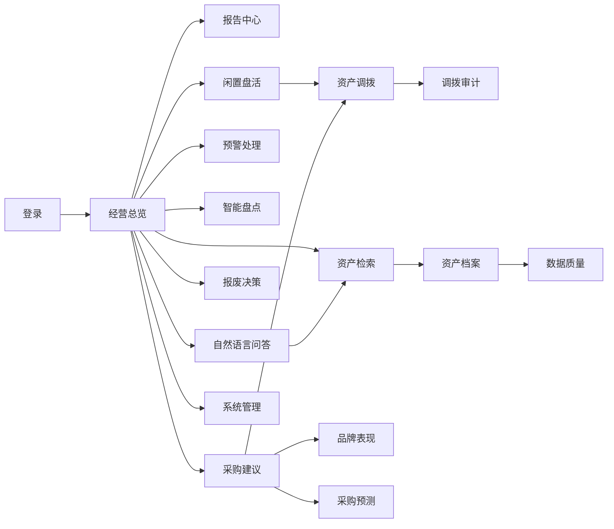
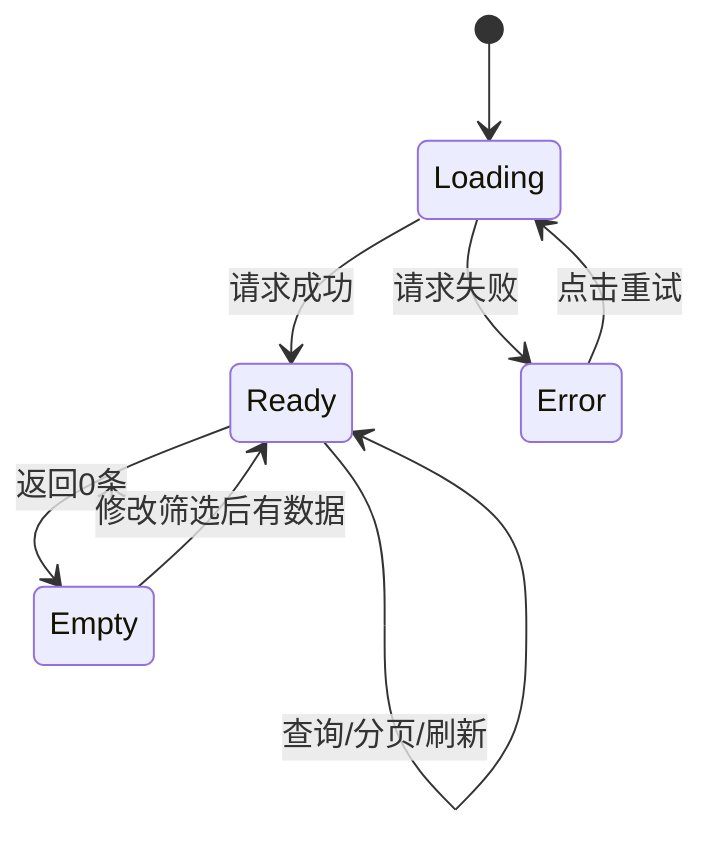

# AI 数智化资产管理系统 UI/UX 升级交付规范

> 适用范围：仅升级原型、布局、视觉和交互表现；不改变既有业务流程、权限、接口字段、状态值或数据库结构。

## ① 现状评估报告

### 1. 页面与入口清单

| 页面 | 路由 | 当前职责 | 主要接口 |
|---|---|---|---|
| 登录 | `/login` | 用户名密码登录 | `/auth/login` |
| 经营总览 | `/dashboard` | KPI、待办、运营指标、趋势、部门排名、预警 | `/dashboard/*` |
| 报告中心 | `/dashboard/report` | 月报生成、任务状态、历史报告下载 | `/dashboard/report*`、`/dashboard/reports` |
| 闲置盘活 | `/idle` | 闲置池筛选、刷新、进入调拨 | `/idle/*` |
| 资产调拨 | `/transfer` | 调拨建议创建、确认、拒绝、执行、取消、审计 | `/transfer/*` |
| 生命周期/资产检索 | `/lifecycle` | 资产搜索、资产档案、盘点/维修/调拨历史 | `/lifecycle/*` |
| 数据质量 | `/lifecycle/quality` | 质量评分、异常资产、质量问题处理 | `/lifecycle/data-quality`、`/quality-issues*` |
| 智能盘点 | `/check` | 盘点任务、诊断、明细和分页 | `/check/*` |
| 品牌表现 | `/insight/brands` | 按类别/品牌分析、样本可信度、证据 | `/insight/*` |
| 采购预测 | `/query/forecast`、`/procurement/forecast` | 预测周期、排序、重新计算 | `/query/forecast*` |
| 采购建议 | `/procurement` | 自然语言预览、规则预览、保存和确认 | `/procurement/*` |
| 报废决策 | `/scrap` | 到期筛选、单个/批量 AI 评估 | `/scrap/*` |
| 自然语言问答 | `/query` | 快捷问题、AI 问答、历史、降级结果 | `/query/nl-query` |
| 条件筛选/导出 | `/query/filter` | 关键词、分类、状态、部门、价值区间、导出 | `/query/assets`、`/query/export` |
| 系统管理 | `/system` | 同步、部门人数、系统配置、AI 配置、用量审计 | `/system/*` |

### 2. 页面流转关系

### 3. 现存 UI 与交互问题

#### 【强制修改】

1. 全局侧栏固定 248px，窄屏会挤压表格；缺少移动端折叠入口。
2. 多个页面使用 `max-height` 表格，底部操作和分页在小屏容易被遮挡。
3. 列表请求缺少统一的加载骨架、错误重试和“筛选后无结果”区分。
4. 调拨、采购、报废等高影响操作的确认提示不统一，缺少操作后状态反馈和失败原因展示。
5. 登录失败只显示通用错误，锁定/网络/服务不可用没有明确引导。
6. 部分页面通过路由复用同一个组件，标题和当前筛选状态容易丢失，返回后上下文不稳定。
7. 表格字段密度较高，金额、日期、状态、责任人缺少统一对齐和格式规范。

#### 【重点优化】

1. 仪表盘信息层级不够明显：KPI、待办、运营指标、图表、预警应按“先行动、后分析”排列。
2. 筛选工具栏在桌面端横向堆叠，缺少“已选条件”摘要和一键清空。
3. 弹窗表单缺少分组、必填说明、提交中防重复点击、服务端错误定位。
4. AI 结果缺少固定的“数据范围/样本/可信度/规则或模型”信息带。
5. 空状态没有区分“暂无数据”“筛选无结果”“加载失败”“权限不可见”。
6. 系统管理页内容较长，配置、同步、审计、AI 用量需要更清晰的任务分组。

#### 【美化可选】

1. 品牌色、状态色、阴影和圆角在页面间基本一致，但标题、辅助文字和数字层级仍可细化。
2. 图表卡片可增加轻量趋势箭头、数据截止时间和更新时间。
3. 侧栏品牌区、页面标题区和卡片标题可采用统一图标与细分隔线。

## ② 全局 UI 设计规范

### 1. 色彩体系

| 用途 | 色值 | 使用规则 |
|---|---|---|
| 主色 | `#1769AA` | 主按钮、当前导航、链接、图表主系列 |
| 主色深 | `#0F4F83` | hover、pressed、深色导航 |
| 页面背景 | `#F4F7FB` | 全局背景，避免纯白大面积刺眼 |
| 卡片 | `#FFFFFF` | 内容容器，边框 `#E2EAF2` |
| 主文字 | `#20334D` | 页面标题、表头、核心数据 |
| 次文字 | `#718198` | 辅助说明、时间、字段提示 |
| 成功 | `#198F6B` | 已完成、正常、通过 |
| 警告 | `#C98516` | 待处理、样本不足、临期 |
| 危险 | `#C84B54` | 失败、逾期、拒绝、异常 |
| 信息 | `#2D83C6` | 处理中、普通提示 |

状态颜色必须同时配合文字，不得只用颜色表达状态。

### 2. 字体与层级

- 中文字体：`Microsoft YaHei`, `PingFang SC`, sans-serif。
- 页面标题：22px / 700；区块标题：16px / 600；卡片指标：28–32px / 700。
- 正文：14px / 400；表格：13px；辅助说明：12px。
- 数字使用等宽或 `font-variant-numeric: tabular-nums`，金额右对齐。

### 3. 间距与布局

- 4px 基础栅格；常用间距 8/12/16/20/24/32px。
- 页面左右内边距：桌面 30px，平板 20px，手机 16px。
- 卡片圆角 10px，卡片内边距 20px；卡片之间 16px。
- 页面结构固定为：页面标题/说明 → 操作区 → 主内容 → 次要内容 → 分页或底部操作。

### 4. 通用组件规范

#### 表格

- 默认展示 20 条，服务端分页；表头浅灰背景，行高 44–48px。
- 金额右对齐并统一千分位；日期统一 `YYYY-MM-DD HH:mm`。
- 状态使用 `el-tag`，操作列固定在右侧；操作超过 3 项收进“更多”。
- 加载使用骨架或表格 loading；无结果显示筛选条件摘要和“清空筛选”。
- 移动端改为卡片列表，保留主标识、状态、金额和首要操作。

#### 按钮

- 主操作每个区域最多一个；破坏性操作使用 danger 并二次确认。
- 文案使用“动作+对象”，如“确认接收”“执行调拨”“保存建议”。
- 提交后按钮进入 loading，接口结束前禁止重复提交。

#### 表单

- 桌面端标签宽 100–120px，移动端改为上下布局。
- 必填项显示星号；数值字段显示单位和范围；错误在字段下方展示。
- 长表单按“基本信息/业务信息/说明”分组，不改变字段，只改变组织方式。

#### 弹窗

- 中等表单宽 520–640px，详情宽 720–960px；移动端宽度 92vw。
- 关闭前若有未保存修改需提示；服务端错误保留在弹窗内，不只弹 toast。
- 成功后关闭弹窗、刷新当前列表并保留筛选和页码。

#### 分页与筛选

- 筛选区首行放高频条件，低频条件进入“更多筛选”；右侧放查询/重置。
- 显示“共 N 条”，切换筛选自动回到第 1 页；分页切换保留条件。
- 展示已选条件 chips，支持逐个移除。

### 5. 响应式断点

- `>=1200px`：侧栏展开，三列图表、完整表格。
- `768–1199px`：侧栏可折叠，图表两列，表格允许横向滚动。
- 本项目不建设移动端专用界面；小于 768px 仅保证页面不崩溃，不承诺完整移动端体验。
- 所有点击目标最小 40px；不得依赖 hover 才能完成操作。

## ③ 各页面逐页优化说明

### 登录页 `/login`

- 原有问题：视觉居中但缺少环境/服务状态；错误提示不区分账号错误、锁定和服务异常。
- 优化方案【强制修改】：保留账号、密码字段和登录流程；增加字段级校验、回车提交、提交 loading、错误状态区；密码错误次数/锁定由后端消息原样呈现。
- 交互细节：登录失败保留账号、清空密码；网络错误提供“重试”；成功后进入原目标页或 `/dashboard`。
- 美化可选：左侧产品价值说明，右侧登录卡片；不增加业务字段。

### 全局布局 `Layout.vue`

- 原有问题：侧栏在窄屏不可用，导航分组较多，当前页层级提示弱。
- 优化方案【强制修改】：增加移动端抽屉、折叠按钮、面包屑/页面说明；保留原菜单和管理员可见性。
- 交互细节：切换路由后移动端自动收起；刷新后保留展开分组；退出登录前清理本地会话。

### 经营总览 `/dashboard`

- 原有问题：内容多且同等权重，待办处理入口弱，运营指标不易下钻。
- 优化方案【重点优化】：顺序固定为 KPI → “待我处理” → 运营效果 → 趋势/分布 → 部门排名/预警；每张卡片增加更新时间和数据范围。
- 交互细节：待办整行可点击并进入既有目标路由；部门排名点击沿用既有部门过滤能力；预警刷新保留滚动位置；空状态区分无待办与加载失败。

### 报告中心 `/dashboard/report`

- 原有问题：生成任务状态展示紧凑，历史报告表缺少筛选和下载反馈。
- 优化方案【重点优化】：生成区、任务进度区、历史报告区三段式；状态使用步骤条/标签，失败显示错误和重试。
- 交互细节：生成按钮提交后禁用；轮询期间展示排队/运行；取消和重试需确认；下载中显示 loading，失败保留当前列表。

### 闲置盘活 `/idle`

- 原有问题：部门和天数筛选不够突出，资产价值与闲置时长阅读负担较大。
- 优化方案【重点优化】：顶部增加统计摘要，筛选区固定；表格按资产标识、部门、价值、闲置天数、建议、操作分组。
- 交互细节：刷新闲置池使用二次确认并显示同步进度；“标记调拨”跳转时携带资产 ID；无结果提供清空筛选。

### 资产调拨 `/transfer`

- 原有问题：状态筛选与操作权限混在一起，创建表单缺少资产上下文和提交反馈。
- 优化方案【强制修改】：状态筛选采用标签计数；操作列按状态显示；创建弹窗分为资产、接收信息、理由三组。
- 交互细节：确认/拒绝/执行/取消均二次确认；拒绝和取消必须填写备注（沿用现有字段）；成功后刷新当前页并保留状态筛选；冲突错误以“资产已被占用/状态已变化”显式展示。

### 生命周期与资产档案 `/lifecycle`

- 原有问题：搜索结果、资产档案和历史记录在同页，层级不清。
- 优化方案【重点优化】：左侧搜索结果、右侧资产档案（桌面）或上下堆叠（移动）；档案采用概览、价值、责任、历史分组。
- 交互细节：输入回车或点击搜索；切换资产时档案区域显示骨架；无历史用 `el-empty`；从其他页面带入 `id` 时自动定位。

### 数据质量 `/lifecycle/quality`

- 原有问题：质量分、异常资产、工单处理入口分散，修复与复核状态辨识弱。
- 优化方案【强制修改】：顶部质量分摘要；问题表按类型/状态/责任人筛选；操作按钮按状态显示“分派/修复/复核”。
- 交互细节：修复前后展示字段差异；复核失败保留说明；批量操作显示影响条数；无问题显示“当前范围无待处理质量问题”。

### 智能盘点 `/check`

- 原有问题：任务选择、诊断结论和明细表切换成本高，分页位置不稳定。
- 优化方案【重点优化】：任务列表使用左侧窄栏；诊断指标置顶；明细表固定表头和底部分页。
- 交互细节：选择任务后并行加载诊断与明细；切换页只刷新明细；高价值盘亏使用危险色并支持进入资产档案。

### 品牌表现 `/insight/brands`

- 原有问题：模式切换、最小样本量、证据字段同时出现，可信度解释不够直观。
- 优化方案【重点优化】：筛选区采用“分析维度→对象→样本阈值”；表格增加可信度说明和证据入口。
- 交互细节：样本不足时保留结果但显示警告；刷新期间禁用筛选提交；证据点击打开只读详情，不新增业务动作。

### 采购预测 `/query/forecast`、`/procurement/forecast`

- 原有问题：周期、排序、升降序控制分散；预测依据阅读层级弱。
- 优化方案【重点优化】：控制区统一成一行；结果表突出预测量，依据作为辅助列；显示计算时间。
- 交互细节：重新计算按钮 loading；切换周期自动提示“将刷新预测结果”；空状态说明暂无足够历史数据。

### 采购建议 `/procurement`

- 原有问题：AI 预览和规则预览关系不清，保存建议的影响范围不突出。
- 优化方案【强制修改】：按“需求输入→利旧/维修/采购缺口→候选型号→保存确认”分段；AI 结果增加可信度和降级提示区。
- 交互细节：AI 预览失败不阻塞规则预览；保存前展示只读摘要并确认；确认后刷新建议列表；数量超限在输入时即时提示。

### 报废决策 `/scrap`

- 原有问题：到期筛选、批量选择、AI 评估反馈密集，评估结果风险信息不够突出。
- 优化方案【重点优化】：筛选和批量工具栏固定；表格突出剩余天数、净值和风险标签；评估弹窗采用结论/依据/风险分组。
- 交互细节：批量评估显示选中数量和进度；单项评估失败可单独重试；关闭弹窗不丢失选择。

### 自然语言问答 `/query`

- 原有问题：快捷问题、对话、结构化结果和降级信息混排；用户不易判断 AI 是否真正调用。
- 优化方案【重点优化】：对话区、快捷问题区、结果证据区分栏；固定显示 `ai_used`、数据截止时间、样本量和错误/降级说明（使用已有返回字段）。
- 交互细节：发送中禁用输入重复提交；结果中的资产链接进入原有档案页；模型不可用时保留规则查询结果并明确标识。

### 条件筛选与导出 `/query/filter`

- 原有问题：筛选项多且横向拥挤，导出操作与查询操作同等突出。
- 优化方案【重点优化】：高频条件首行，价值区间和闲置条件置于更多筛选；导出按钮放在结果区右上并显示权限状态。
- 交互细节：查询自动回到第 1 页；重置清空 chips；导出期间显示进度/禁用按钮；无权限时展示原因而不是静默失败。

### 系统管理 `/system`

- 原有问题：同步、部门人数、系统参数、AI 配置、AI 用量内容过长；审计明细难以检索。
- 优化方案【重点优化】：保留现有 tabs，内部采用“任务卡片 + 配置卡片 + 审计表”；AI 用量摘要与日志表固定表头，增加日期/场景/结果筛选（使用现有接口参数）。
- 交互细节：同步操作显示任务状态；配置保存前展示变更摘要；API Key 继续密码框显示；审计表支持分页和复制请求 ID。

## ④ 优化后页面交互说明（前端交付版）

### 通用页面状态机

每个列表页面必须实现：`loading`、`ready`、`empty`、`error` 四种状态；不得用空数组同时表示加载中和无数据。

### 交互实现约束

1. 所有既有 API 调用保持路径、HTTP 方法、参数名和返回字段不变；仅允许增加前端展示状态和布局容器。
2. 所有写操作必须具备 loading、防重复提交、成功 toast、失败可读错误和局部刷新。
3. 所有跨页跳转通过现有路由和 query 参数传递资产 ID、任务 ID、报告 ID，不新增业务参数。
4. 所有表格分页、筛选、排序在请求期间保留当前条件；筛选条件变化回到第 1 页。
5. 所有 AI 相关页面必须展示已有可信度、降级、数据范围或证据字段；禁止前端自行推断结论。
6. 所有敏感信息继续使用密码框、脱敏文本或权限控制展示；不在 toast、日志或 URL 中输出密钥。
7. 断点适配优先级：先保证操作可完成，再保证表格完整展示；移动端允许横向滚动但不允许按钮不可点击。

## 待确认项

以下事项不影响本方案落地，但在视觉定稿前需产品确认：

1. 是否保留当前深蓝侧栏作为品牌识别，还是切换为浅色导航。
2. 企业正式品牌色、Logo、字体和无障碍对比度标准是否已有统一规范。
3. 移动端是否只支持浏览器窄屏，还是需要专门的平板横屏布局。
4. 运营驾驶舱下钻已确定采用同页右侧抽屉；部门排名打开资产明细和最近审计，继续复用现有查询与审计接口。
